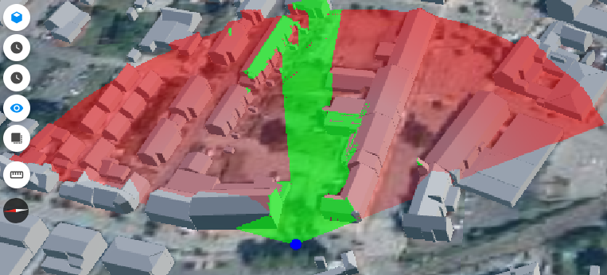
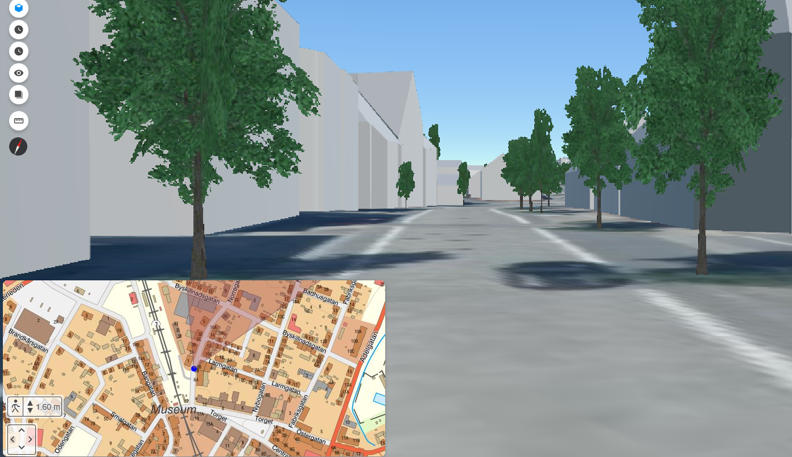
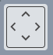
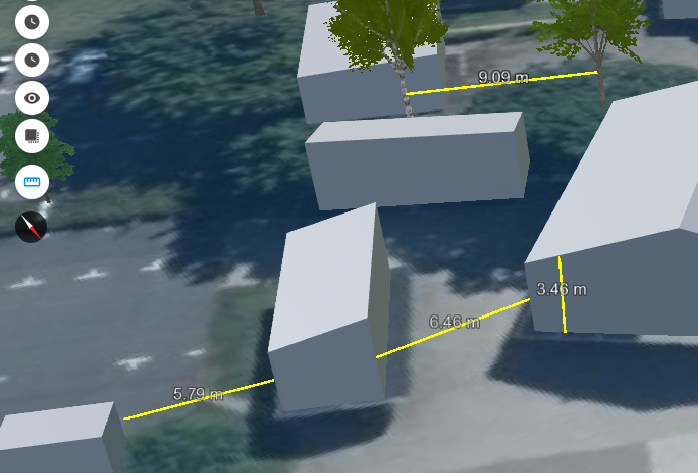
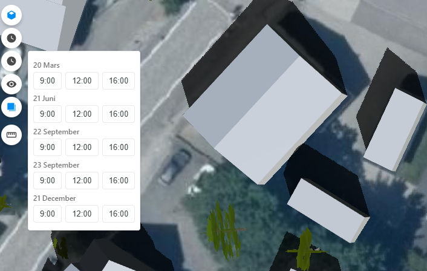

# Origo globe plugin
A plugin for [Origo map](https://github.com/origo-map/origo) to enable a [CesiumJS](https://cesium.com/platform/cesiumjs/) globe using [Ol-Cesium](https://openlayers.org/ol-cesium/).


## Setup

See [index_example.html](https://github.com/haninge-geodata/origo-globe-plugin/blob/main/index_example.html) and [index_example.json](https://github.com/haninge-geodata/origo-globe-plugin/blob/main/index_example.json) to get started with configuration.

Origo Globe plugin only works with reference system EPSG:3857. Make sure that `index.json` is set to use EPSG:3857.

Copy the files in the `build` folder and place them in Origo's `plugins/globe` folder.

ℹ️ Due to loading issues, ol-cesium needs to be loaded from Origo-map.

Install ol-cesium:
```
npm install olcs
```
In [origo.js](https://github.com/origo-map/origo/blob/master/origo.js), add:

```
import OLCesium from 'olcs/OLCesium';

window.OLCesium = OLCesium;
```

## Layer configuration

To add 3D layers to the viewer, please see `index_example.json`.

### Custom terrain tiles

To add a custom terrain provider that points to a local terrain tile folder, specify it in your `index.html` configuration:

```js
    cesiumTerrainProvider: 'path/to/your/terrain',
```

### Custom 3D-tile layer

Within `index.json`, add your custom 3D-tile layer as shown below:

```js
{
    "name": "Byggnader",
    "title": "Byggnader",
    "type": "THREEDTILE",
    "url": "path/to/your/3Dtiles/tileset.json",
    "visible": true,
    "style": {
        "color": "color('#FFFFFF', 1)"
    }
}
```

Changing `style` will affect the appearance of the 3D layer.

### glb/gltf models

To add glb/gltf models, use the example below. Several models can be added inside the array "models".

```js
{
    "name": "GLB",
    "title": "GLB",
    "type": "THREEDTILE",
    "dataType": "model",
    "url": "path/to/your/GLB-GLTF-files",
    "visible": true,
    "models": [
        {
            "fileName": "hus1.glb",
            "lat": 55.54734220671179,
            "lng": 13.949731975672035,
            "height": 66.0,
            "heightReference": "NONE",
            "rotHeading": 0,
            "animation": false
        },
        ...
    ]
}
```

### Extruded 2D-layer

To add 2D data as 3D extruded objects, add the layer as shown below.

**Requirements:**
- The data must have two height attributes: the height at the top of the object and the height at the bottom of the object, both relative to the geoid.

Inside the `extrusion` attribute, assign the attribute values to `groundAttr` (height at the bottom of the object) and `roofAttr` (height at the top of the object).

(Only tested with GeoServer)

```js
{
    "name": "geostore:Byggnader",
    "title": "Byggnader2D",
    "dataSource": "https://mapserver.com/WFS",
    "type": "THREEDTILE",
    "dataType": "extrusion",
    "extrusion": {
        "groundAttr": "mark_hojd",
        "roofAttr": "tak_hojd",
        "color": "LIGHTGRAY",
        "opacity": 0.9,
        "outline": true,
        "outlineColor": "RED"
    },
    "visible": true
}
```
Changing `color`, `opacity`, `outline`, and `outlineColor` will affect the appearance of the layer.

## Functions

All functions described in this section can be enabled or disabled in the `Globe` configuration (see below) within `index.html`:

```js
const globe = Globe({
    viewShed: true,
    streetView: true,
    cameraControls: true,
    measure: true,
    quickTimeShadowPicker: true,
    flyTo: false,
    // ...
});
```

### ViewShed

The ViewShed feature analyzes the visible area from a selected point, taking into account terrain and 3D objects (such as buildings and trees) that may obstruct the view.

To use this function:
1. Activate the ViewShed tool.
2. Select the origin point for the analysis.
3. Select the endpoint to define the direction and extent of the viewshed.



### StreetView

The StreetView feature allows users to navigate through the 3D environment at ground level, providing an immersive experience similar to real-world street-level exploration. This feature lets you move around, look in different directions, and explore the environment as if you were walking through it.

To use this function:
1. Activate StreetView by pressing the person icon at the bottom left corner.
2. Select the point on the map where you want to enter StreetView.
3. To exit StreetView mode, press the person icon again.

While in this mode, you can change the simulated height by pressing the up and down arrows beside the person icon, tilt the camera, and click on the ground in the viewer to pan to new areas.



### CameraControls

If enabled, extra controls are added to the map in the bottom left corner.
With these controls, the user can tilt and rotate the camera using buttons.



### Measure

The Measure tool can measure between 3D objects and also between terrain and 3D objects.



### QuickTimeShadowPicker

Enables quick access to dates and times of equinoxes and solstices.



### FlyTo

If activated, FlyTo will animate the camera to pan and zoom to focus on the selected object.
