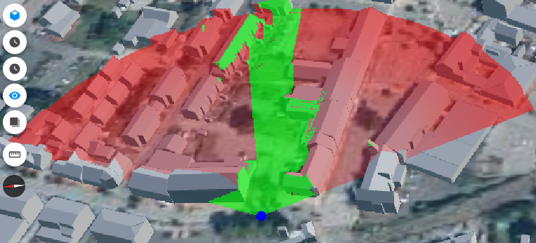
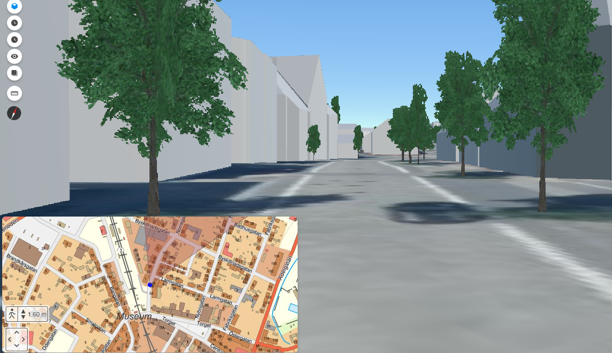
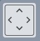
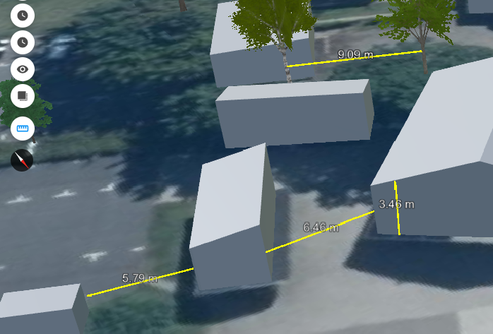
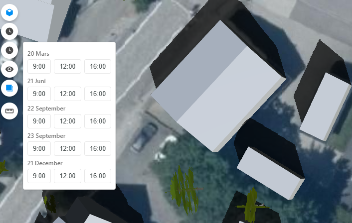

# Origo globe plugin
A plugin for [Origo map](https://github.com/origo-map/origo) to enable a [CesiumJS](https://cesium.com/platform/cesiumjs/) globe using [Ol-Cesium](https://openlayers.org/ol-cesium/).


## Setup

See [index_example.html](https://github.com/haninge-geodata/origo-globe-plugin/blob/main/index_example.html) and [index_example.json](https://github.com/haninge-geodata/origo-globe-plugin/blob/main/index_example.json) to get started with configuration.

Copy the files in the `build` folder and place them in Origo's `plugins/globe` folder.

ℹ️ Due to loading issues, ol-cesium needs to be loaded from Origo-map.

Install ol-cesium:
```
npm install olcs
```
In [origo.js](https://github.com/origo-map/origo/blob/master/origo.js), add:

```
import OLCesium from 'olcs/OLCesium';

window.OLCesium = OLCesium;
```
s
## Configuration

All globe settings can be configured in `index.json` under the `"3D"` section. This keeps all 3D-related configuration in one place.

### Full configuration example

```json
{
  "3D": {
    "showGlobe": true,
    "globeOnStart": true,
    "viewShed": true,
    "streetView": true,
    "streetViewMap": "name of a layer from 'ayers' config",
    "drawTool": {
      "active": true,
      "options": {
        "export": {
          "geojson": true,
          "dxf": true,
          "dxfCrs": ["EPSG:3006", "EPSG:4326"]
        },
        "share": true,
        "defaultColor": "white",
        "defaultHeight": 10
      }
    },
    "cameraControls": true,
    "measure": true,
    "quickTimeShadowPicker": true,
    "flyTo": false,
    "settings": {
      "depthTestAgainstTerrain": true,
      "enableAtmosphere": true,
      "enableGroundAtmosphere": true,
      "enableFog": false,
      "enableLighting": true,
      "shadows": {
        "darkness": 0.3,
        "fadingEnabled": true,
        "maximumDistance": 1000,
        "normalOffset": true,
        "size": 4096,
        "softShadows": false
      },
      "skyBox": {
        "url": "plugins/globe/cesiumassets/Assets/Textures/SkyBox/",
        "images": {
          "pX": "tycho2t3_80_px.jpg",
          "nX": "tycho2t3_80_mx.jpg",
          "pY": "tycho2t3_80_py.jpg",
          "nY": "tycho2t3_80_my.jpg",
          "pZ": "tycho2t3_80_pz.jpg",
          "nZ": "tycho2t3_80_mz.jpg"
        }
      }
    },
    "cesiumIontoken": "your-cesium-ion-token",
    "cesiumTerrainProvider": "path/to/your/terrain"
  }
}
```

### Configuration options

| Option | Type | Default | Description |
|--------|------|---------|-------------|
| `showGlobe` | boolean | `true` | Show/hide the globe |
| `globeOnStart` | boolean | `false` | Automatically enable 3D mode on load |
| `viewShed` | boolean | `false` | Enable viewshed analysis tool |
| `streetView` | boolean | `false` | Enable street-level view mode |
| `streetViewMap` | string | `""` | Layer name to use as ground texture in street view |
| `cameraControls` | boolean | `false` | Show camera tilt/rotate buttons |
| `measure` | boolean | `false` | Enable 3D measurement tools |
| `quickTimeShadowPicker` | boolean | `false` | Enable quick time/date picker for shadows |
| `flyTo` | boolean | `false` | Animate camera when selecting objects |
| `drawTool` | object/boolean | `false` | Drawing tool configuration (see below) |
| `cesiumIontoken` | string | - | Your Cesium Ion access token |
| `cesiumTerrainProvider` | string | - | Path to custom terrain tiles |

### Draw tool options

```json
"drawTool": {
  "active": true,
  "options": {
    "export": {
      "geojson": true,
      "dxf": true,
      "dxfCrs": ["EPSG:3008", "EPSG:4326"]
    },
    "share": true,
    "defaultColor": "white",
    "defaultHeight": 10
  }
}
```

| Option | Type | Default | Description |
|--------|------|---------|-------------|
| `export.geojson` | boolean | `true` | Enable GeoJSON export |
| `export.dxf` | boolean | `true` | Enable DXF export |
| `export.dxfCrs` | string[] | `["EPSG:3006"]` | Coordinate systems for DXF export (see table below) |
| `share` | boolean | `true` | Enable share URL feature |

#### Available DXF coordinate systems (SWEREF99)

| EPSG Code | Name | Description |
|-----------|------|-------------|
| `EPSG:3006` | SWEREF99 TM | National system (default) |
| `EPSG:3007` | SWEREF99 12 00 | Local zone 12°00' |
| `EPSG:3008` | SWEREF99 13 30 | Local zone 13°30' |
| `EPSG:3009` | SWEREF99 15 00 | Local zone 15°00' |
| `EPSG:3010` | SWEREF99 16 30 | Local zone 16°30' |
| `EPSG:3011` | SWEREF99 18 00 | Local zone 18°00' |
| `EPSG:3012` | SWEREF99 14 15 | Local zone 14°15' |
| `EPSG:3013` | SWEREF99 15 45 | Local zone 15°45' |
| `EPSG:3014` | SWEREF99 17 15 | Local zone 17°15' |
| `EPSG:3015` | SWEREF99 18 45 | Local zone 18°45' |
| `EPSG:3016` | SWEREF99 20 15 | Local zone 20°15' |
| `EPSG:3017` | SWEREF99 21 45 | Local zone 21°45' |
| `EPSG:3018` | SWEREF99 23 15 | Local zone 23°15' |
| `defaultColor` | string | `"white"` | Default polygon color (white, red, green, blue, yellow, cyan) |
| `defaultHeight` | number | `10` | Default extrusion height in meters |

### Minimal configuration in index.html

With the new configuration system, `index.html` only needs:

```js
origo.on('load', async (viewer) => {
  const indexJson = await fetch('index.json').then(r => r.json());
  const globe = Globe({
    indexJson: indexJson,
  });
  viewer.addComponent(globe);
});
```

Settings can still be passed directly to `Globe({...})` to override values from `index.json`.


## Layer configuration

To add 3D layers to the viewer, please see `index_example.json`.

### Custom terrain tiles

To add a custom terrain provider, specify it in your `index.json` under the `"3D"` section:

```json
"3D": {
  "cesiumTerrainProvider": "path/to/your/terrain"
}
```

### Custom 3D-tile layer

Within `index.json`, add your custom 3D-tile layer as shown below:

```json
{
    "name": "Byggnader",
    "title": "Byggnader",
    "type": "THREEDTILE",
    "url": "path/to/your/3Dtiles/tileset.json",
    "visible": true,
    "style": {
        "color": "color('#FFFFFF', 1)"
    }
}
```

Changing `style` will affect the appearance of the 3D layer.

### glb/gltf models

To add glb/gltf models, use the example below. Several models can be added inside the array "models".

```json
{
    "name": "GLB",
    "title": "GLB",
    "type": "THREEDTILE",
    "dataType": "model",
    "url": "path/to/your/GLB-GLTF-files",
    "visible": true,
    "models": [
        {
            "fileName": "hus1.glb",
            "lat": 55.54734220671179,
            "lng": 13.949731975672035,
            "height": 66.0,
            "heightReference": "NONE",
            "rotHeading": 0,
            "animation": false
        }
    ]
}
```

#### Model animation options

| Option | Type | Default | Description |
|--------|------|---------|-------------|
| `animation` | boolean | `false` | Enable animation playback for this model |
| `animationDuration` | number | (native speed) | Duration in seconds for one complete animation loop |

**Example with animation:**
```json
{
    "fileName": "windmill.glb",
    "lat": 55.547,
    "lng": 13.949,
    "height": 66.0,
    "animation": true,
    "animationDuration": 5
}
```

This plays the model's animation, completing one full loop every 5 seconds. If `animationDuration` is omitted, the animation plays at its native speed.

### Extruded 2D-layer

To add 2D data as 3D extruded objects, add the layer as shown below.

**Requirements:**
- The data must have two height attributes: the height at the top of the object and the height at the bottom of the object, both relative to the geoid.

Inside the `extrusion` attribute, assign the attribute values to `groundAttr` (height at the bottom of the object) and `roofAttr` (height at the top of the object).

(Only tested with GeoServer)

```json
{
    "name": "geostore:Byggnader",
    "title": "Byggnader2D",
    "dataSource": "https://mapserver.com/WFS",
    "type": "THREEDTILE",
    "dataType": "extrusion",
    "extrusion": {
        "groundAttr": "mark_hojd",
        "roofAttr": "tak_hojd",
        "color": "LIGHTGRAY",
        "opacity": 0.9,
        "outline": true,
        "outlineColor": "RED"
    },
    "visible": true
}
```
Changing `color`, `opacity`, `outline`, and `outlineColor` will affect the appearance of the layer.


## Functions

All functions described in this section can be enabled or disabled in `index.json` under the `"3D"` section.

### ViewShed

The ViewShed feature analyzes the visible area from a selected point, taking into account terrain and 3D objects (such as buildings and trees) that may obstruct the view.

To use this function:
1. Activate the ViewShed tool.
2. Select the origin point for the analysis.
3. Select the endpoint to define the direction and extent of the viewshed.
4. Drag the blue start point to adjust the viewshed position.



### StreetView

The StreetView feature allows users to navigate through the 3D environment at ground level, providing an immersive experience similar to real-world street-level exploration. This feature lets you move around, look in different directions, and explore the environment as if you were walking through it.

To use this function:
1. Activate StreetView by pressing the person icon at the bottom left corner.
2. Select the point on the map where you want to enter StreetView.
3. To exit StreetView mode, press the person icon again.

While in this mode, you can change the simulated height by pressing the up and down arrows beside the person icon, tilt the camera, and click on the ground in the viewer to pan to new areas.



### CameraControls

If enabled, extra controls are added to the map in the bottom left corner.
With these controls, the user can tilt and rotate the camera using buttons.



### Measure

The 3D Measure tool provides four measurement modes:

| Mode | Description |
|------|-------------|
| **Distance** | Measure 3D distance between two points on terrain or 3D objects |
| **Height** | Measure vertical height difference between two points |
| **Footprint** | Measure horizontal projected area (like looking straight down) - useful for land plots and building footprints |
| **Surface** | Measure true surface area - useful for roofs, walls, slopes, and terrain |

#### Footprint vs Surface Area

| Tool | What it measures | Example (10×10m roof at 45° pitch) |
|------|------------------|-------------------------------------|
| **Footprint** | Horizontal projection — the "shadow" area as seen from above | ~100 m² |
| **Surface** | True 3D surface area — the actual tilted/curved surface | ~141 m² |

**Use Footprint for:** Land parcels, building coverage, floor plans, zoning calculations  
**Use Surface for:** Roofing materials, painting walls, grass seed for slopes, actual material estimates

To use:
1. Select measurement mode from the toolbar.
2. For distance/height: click two points on the map.
3. For footprint/surface area: click multiple points to define the polygon, then right-click to complete.
4. Use the clear button to remove all measurements.



### QuickTimeShadowPicker

Enables quick access to dates and times of equinoxes and solstices for shadow analysis.



### FlyTo

If activated, FlyTo will animate the camera to pan and zoom to focus on the selected object.

### Draw

The Draw tool allows you to create 3D extruded polygons and rectangles on the map. By activating draw, you get a toolbar at the bottom of the screen.

#### Drawing tools

| Tool | Description |
|------|-------------|
| **Polygon** | Draw freeform polygons by clicking corners. Right-click to finish. |
| **Rectangle** | Draw rectangles by clicking two opposite corners. |

#### Toolbar buttons

| Button | Description |
|--------|-------------|
| Height | Set the extrusion height (in meters) for new polygons |
| Color | Choose fill color (white, red, green, blue, yellow, cyan) |
| Opacity | Toggle between transparent (70%) and opaque (100%) |
| Clear | Remove all drawn polygons |
| Labels | Toggle polygon information labels on/off |
| Share | Copy a shareable URL to clipboard containing all drawn polygons |
| Download | Export polygons as GeoJSON or DXF (with configurable coordinate systems) |

#### Editing individual polygons

Click on any drawn polygon to select it. A secondary toolbar appears with editing options:

| Option | Description |
|--------|-------------|
| Name | Edit the polygon's name |
| Height | Change the extrusion height |
| Color | Change the fill color |
| Opacity | Toggle transparency |
| Delete | Remove this polygon |
| Deselect | Close the edit panel |

The polygon outline turns yellow when selected.

#### Polygon labels

Each polygon displays information including:
- Name
- Base height (terrain level)
- Extrusion height
- Top elevation (base + extrusion)
- Area in m²

#### Export formats

- **GeoJSON 2D (EPSG:4326)**: Standard GeoJSON with 2D coordinates. Properties include extrudeHeight, baseHeight, area, color, and fillAlpha for 3D reconstruction.
- **DXF 3D**: AutoCAD-compatible format with full 3D geometry, supports multiple coordinate systems (SWEREF99 zones)

#### Sharing

The share button creates a URL containing all drawn polygons. When someone opens the link:
- 3D mode activates automatically
- All shared polygons are loaded and displayed
- The view zooms to fit all polygons
